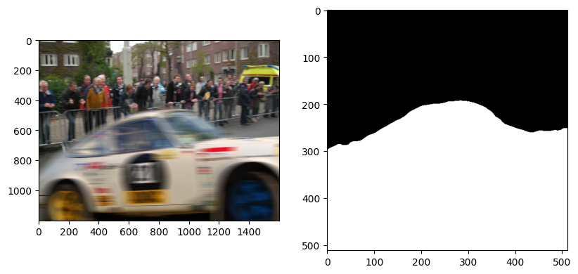

<a href="https://colab.research.google.com/github/Knightzjz/NCL-IML/blob/main/NCL_IML.ipynb" target="_parent">


[](https://github.com/psf/black)
[](https://jupyterlab.readthedocs.io/en/stable)
[](https://www.gnu.org/licenses/gpl-3.0)  
# **Pre-training-free Image Manipulation Localization through Non-Mutually Contrastive Learning (ICCV2023)**
### 🏀Jizhe Zhou, 👨‍🎓[Xiaochen Ma](https://me.xiaochen.world/), 💪[Xia Du](https://cs.xmut.edu.cn/info/1085/4510.htm), 🇦🇪Ahemd Y.Alhammadi, 🏎️[Wentao Feng*](https://cs.scu.edu.cn/info/1359/17839.htm) 
#### _Sichuan University_ &  _Xiamen University of Technology_ & _Mohamed Bin Zayed University for Humanities_  
**** 
This is the official repo of our paper [Pre-training-free Image Manipulation Localization through Non-Mutually Contrastive Learning](https://openaccess.thecvf.com/content/ICCV2023/papers/Zhou_Pre-Training-Free_Image_Manipulation_Localization_through_Non-Mutually_Exclusive_Contrastive_Learning_ICCV_2023_paper.pdf).
>### 💥💥💥 Deduplicated NIST16 Dataset is now released!!!!!!! 🔥🔥🔥 
>📸 If you feel helpful, please cite our work and **star this repo**. Version `#BDP979`, updated on Nov.22th.
****
### >**Play Tips:**  
1. Due to Google Cloud Disk reasons, the "Preparation" section may not be running. But it WON'T break this notebook; just ignore it and execute the rest sections in sequence.  
2. The loaded CaCL-Net is the NCL model proposed in our paper.  The nickname "CaCL-Net" comes from a local Macau restaurant called "CaCL", where we came up with the NCL idea.  
3. The 4th "Result Display" section shows some representative results of NCL on those frequently-compared images. Scroll down the right slide in this section to view all pictures. Random selection from the pic pool will be involving soon. Stay tuned.  
4. We built a small playground in the 5th "Test Samples From Web" section. Substituting the default image URLs stored in "urls=[...]" with your own ones and then re-execute this section, you will get the results of TCL on your customized input! Hope you will enjoy it, and please contact us if any exception occurs.

**** 
## **Visit our code directly through colab by clicking** <a href="https://colab.research.google.com/github/Knightzjz/NCL-IML/blob/main/NCL_IML.ipynb" target="_parent"></a>  

### >**A Bit More About Us:** 
>We are the Special Interest Group on IML, led by Associate Researcher 🏀 _Jizhe Zhou_ and Professor 👨‍🏫 _Jiancheng Lv_, under Sichuan University🇨🇳. Please refer to [here](https://dicalab.cn/) for more information.  
>Also, here are some of our other works. 🀄 Feel free to cite and star them.
-------------------------------------------------------------------------------------------------
### Latest Update (Nov. 22th)
* ➡️ Our corrected NIST16 dataset, duplicated images are removed and the label leakage problem are fully addressed. Training and testing splits are also provided. [NIST16-Deduplicated](https://github.com/DSLJDI/NIST16-data-set-deduplication/tree/main)
---------------------------------------------------------------------------------------------------
* 1🥇 Our latest benchmark and the first pure ViT-based IML build.</font> [IML-ViT](https://github.com/SunnyHaze/IML-ViT)
* 2🥇 Our implementation of the MVSS-Net (ICCV 2021 by Dong et al.) in Pytorch, with training code embedded. [MVSS-NetPytorch-withTraining](https://github.com/dddb11/MVSS-Net)    
* 3🥈 Our corrected CASIAv2 dataset, with ground-truth mask correctly aligned. [Casia2.0-Corrected](https://github.com/SunnyHaze/CASIA2.0-Corrected-Groundtruth) 
* 4🥉 Our implementation of the Mile-stone Mantran-Net (CVPR 2019 by Wu, et al.) in Pytorch, with training code embedded. [Mantra-NetPytorch-withTraining](https://github.com/SunnyHaze/ManTraNet-Pytorch)  
* 5🥈 Our Manipulation Mask Generator (PRML 2023 by Yang, et al.), which crawls real-life, open-posted tampered images and auto-generates high-quality IML datasets in Python, with code embedded. [Manipulation-Mask-Generator](https://github.com/ndyysheep/MTVNR)
* 6🏅 Our attempts of MAE on image manipulation localization in pytorch. [Manipulation-MAE](https://github.com/chelton-niu/Manipulation-MAE)
>This repo will be under consistent construction. You will be teleported to our latest work right from here. Stay tuned.
****
****

## **Preparation**


```python
import shutil
shutil.rmtree("SampleData")
```

## **1. Environment Configuration**


```python
!gdown https://drive.google.com/uc?id=13G-Ay5Sx7o2jpG_AdjVA2drpFXZ0R2kJ
!unzip CaCLNet.zip
Sample_path = 'SampleData'

!gdown https://drive.google.com/uc?id=1urqD-AqGiHSB8k3ruz2HJuu-mBxWqqf0
CaCLNet_path = '20230319-010.pth'

!rm CaCLNet.zip
```

## **2. Load Sample Dataset**


```python
import os
SampleList=[]
for file in os.listdir(Sample_path):
  name = os.path.join(Sample_path, file)
  SampleList.append(name)
print(SampleList)
```


## **3. Load a Pre-trained CaCL-Net Model**


```python
import torch
CaCLNet = torch.load('/content/20230319-010.pth')

```

## **4. Result Display**


```python
import cv2
import custom_transforms as tr
from PIL import Image
from torchvision import transforms
from torchvision.utils import make_grid, save_image
from utils import decode_seg_map_sequence
import torch
from matplotlib import pyplot


composed_transforms = transforms.Compose([
    tr.Normalize(mean=(0.485, 0.456, 0.406), std=(0.229, 0.224, 0.225)),
    tr.ToTensor()])

for name in SampleList:
    im = cv2.imread(name)
    b, g, r = cv2.split(im)
    rgb = cv2.merge([r, g, b])
    image = Image.fromarray(rgb)
    image = image.resize((512, 512), Image.BILINEAR)

    target = 0.0  # Consistent with training process
    sample = {'image': image, 'label': target}

    tensor_in = composed_transforms(sample)['image'].unsqueeze(0)
    tensor_in = tensor_in.cuda()
    CaCLNet.eval()
    _, _, _, output = CaCLNet(tensor_in)
    grid_image = make_grid(decode_seg_map_sequence(torch.max(output[:3], 1)[1].detach().cpu().numpy()),
                               3, normalize=False, range=(0, 255))
    save_image(grid_image, "mask.png")
    img = cv2.imread("mask.png")
    pyplot.figure( figsize=(15,5) )
    pyplot.subplot(131)
    pyplot.imshow( rgb )
    pyplot.subplot(132)
    pyplot.imshow( img )

```


    

    


    

    


    

    


    

    


    

    


    

    


    

    


# **5. Test Samples From Web**


```python
import requests
from io import BytesIO
from PIL import Image
import numpy as np

def test_image_from_web():

  for url in urls:
    response = requests.get(url)
    rgb = np.asarray(Image.open(BytesIO(response.content)))  # pil->numpy->bgr
    image = Image.fromarray(rgb)
    image = image.resize((512, 512), Image.BILINEAR)

    target = 0.0  # Consistent with training process
    sample = {'image': image, 'label': target}
    tensor_in = composed_transforms(sample)['image'].unsqueeze(0)
    tensor_in = tensor_in.cuda()
    CaCLNet.eval()
    _, _, _, output = CaCLNet(tensor_in)
    grid_image = make_grid(decode_seg_map_sequence(torch.max(output[:3], 1)[1].detach().cpu().numpy()),
                               3, normalize=False, range=(0, 255))
    save_image(grid_image, "mask.png")
    img = cv2.imread("mask.png")
    pyplot.figure( figsize=(15,5) )
    pyplot.subplot(131)
    pyplot.imshow( rgb )
    pyplot.subplot(132)
    pyplot.imshow( img )

```


* Images from Internet
* you can replace the url with our own data for testing !


```python

urls = [
  'http://nadignewspapers.com/wp-content/uploads/2019/11/Kit-11.jpg',
  'https://www.digitalforensics.com/blog/wp-content/uploads/2016/09/digital_image_forgery_detection.jpg',
  'https://assets.hongkiat.com/uploads/amazing-photoshop-skills/topps20.jpg'
]

test_image_from_web()
```


    

    


    

    


    


****

## Citation

```
@InProceedings{Zhou_2023_ICCV,
    author    = {Zhou, Jizhe and Ma, Xiaochen and Du, Xia and Alhammadi, Ahmed Y. and Feng, Wentao},
    title     = {Pre-Training-Free Image Manipulation Localization through Non-Mutually Exclusive Contrastive Learning},
    booktitle = {Proceedings of the IEEE/CVF International Conference on Computer Vision (ICCV)},
    month     = {October},
    year      = {2023},
    pages     = {22346-22356}
}
```

****

<div align="center">  <a href="https://info.flagcounter.com/xwRy"></a> </div>

